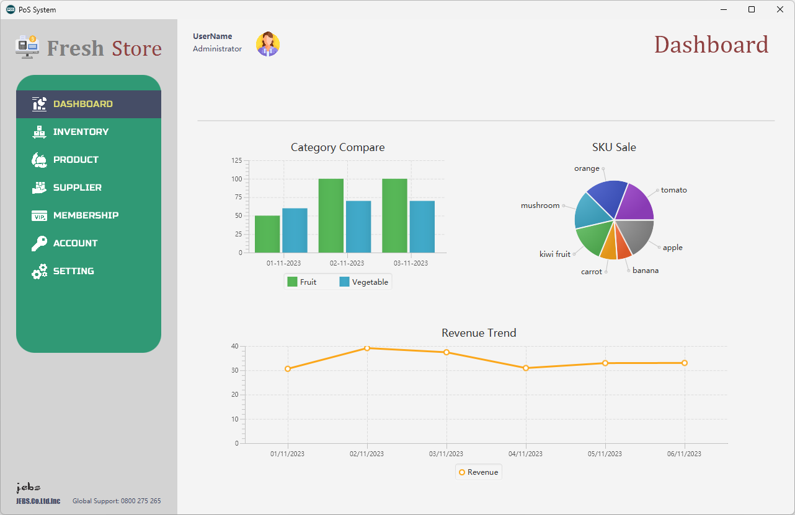
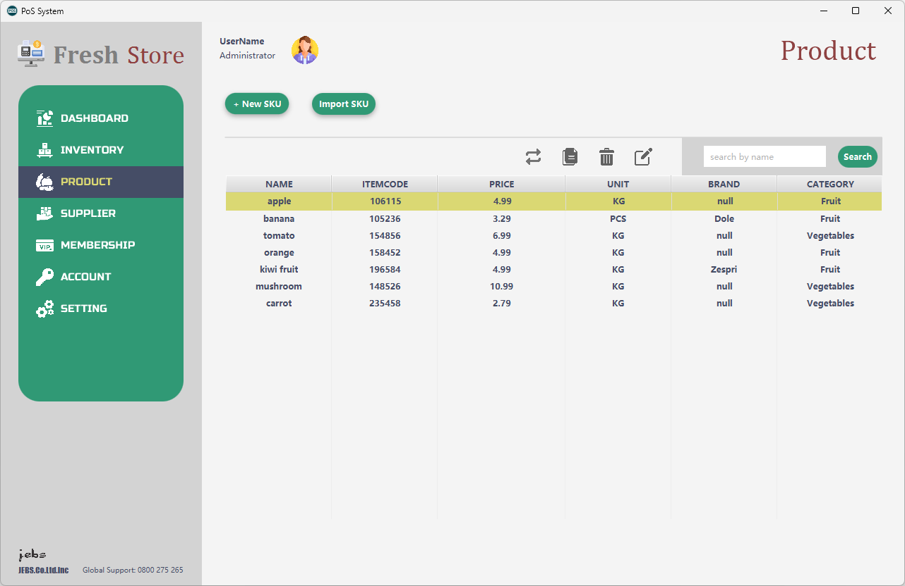

# PoS System 
## Introduction:
This is a team project aimed at developing a POS (Point of Sale) system while learning about software development lifecycle and testing. I contributed 95% of the code in the system, hence I am primarily responsible for maintaining the code repository. The DashBoard, Inventory, and Product subpages have been completed, while the rest are pending. The target users of this software are administrative personnel who manage backend data, such as store owners and managers. A significant amount of CSS code was used in this project for interface beautification.

Find the executable application (point_of_sale.exe) from Google Drive:  
[Edmond's Java Program Collection.zip (Windows)](https://drive.google.com/file/d/1ve7sEscvtVldRKZU-B3VhaQdORteksQk/view?usp=drive_link)

## Snapshot
 
 

## Features
- CRUD operations on products.
- Storing data in CSV (Comma-Separated Values) format.
- Real-time synchronization with database.
- Data recover on database corruption.
- Import data from external csv file.
- Sales & revenue statistics on real order data.

## Tech Stack 
| Type | Name |
| ----------- | ----------- 
| Programming Language | Java |
| GUI Library | Java FX |
| GUI Tool | Scene Builder|

## Library
commons-csv-1.10.0.jar

## Run Instruction
### Requirement:
- Java Runtime Environment
- Java FX
### Steps:   
To run the application in your local machine, please follow the steps below:
1. Clone the repository from the GitHub  
2. Add JavaFX and commons-csv to Build Path
3. Add the VM arguments to the run configure:  
`--module-path "<PATH TO YOUR JavaFX/lib>" --add-modules javafx.controls,javafx.fxml`
4. Run the *POSLauncher.java* in the *application* package.

## License
MIT